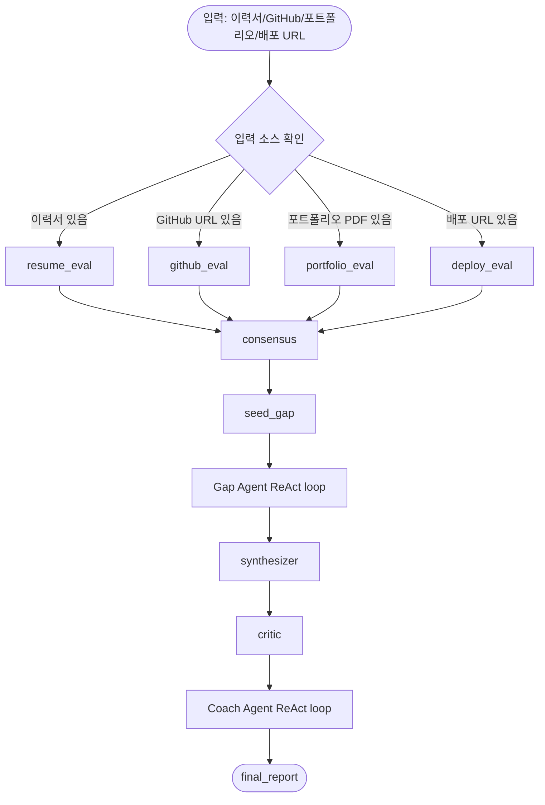
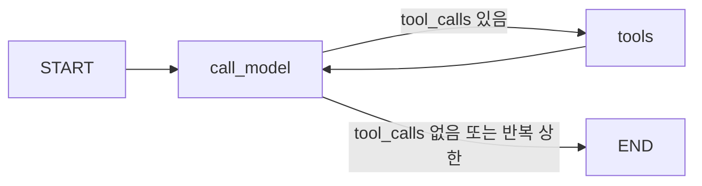
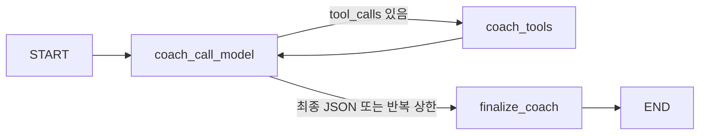

# Job Skill Analyzer 프로젝트 아키텍처와 변경사항 정리

작성일: 2026-08-27  
배포 URL: https://gaheelee-job-graph.hf.space/  
배포 커밋: `e037014 Improve portfolio analysis safety and coaching reliability`

## 1. 프로젝트 한 줄 요약

Job Skill Analyzer는 이력서 PDF, GitHub 저장소, 포트폴리오 PDF, 배포 URL을 함께 분석해 지원자의 보유 스킬을 검증하고, 목표 직군 대비 부족한 스킬과 면접/프로젝트 보강 코칭을 생성하는 Agentic RAG 기반 커리어 분석 시스템이다.

핵심은 단순 키워드 매칭이 아니라 다음 세 가지를 분리해서 판단하는 것이다.

- 이력서에 적힌 자기 주장
- GitHub/배포 URL/포트폴리오로 확인되는 실제 근거
- 채용공고 그래프 데이터가 요구하는 직군별 스킬

최종 리포트는 적합도, 검증 등급, 부족 스킬, 프로젝트 보강 제안, 학습 추천, 면접 코칭을 함께 제공한다.

## 2. 전체 시스템 구성

주요 레이어는 다음과 같다.

1. 데이터 레이어
   - 채용공고와 스킬 데이터를 Neo4j에 저장한다.
   - 직군별 요구 스킬, 선호 스킬, 스킬 공출현, 추천 공고 조회에 사용된다.

2. 입력 평가 레이어
   - 이력서 PDF 또는 텍스트
   - GitHub 저장소 URL
   - 포트폴리오 PDF
   - 배포 URL
   - 입력된 소스만 선택적으로 평가한다.

3. Supervisor LangGraph 레이어
   - 평가자들을 병렬 실행한다.
   - consensus에서 스킬 검증 등급을 결정한다.
   - Gap Agent, Synthesizer, Critic, Coach Agent를 순서대로 실행한다.

4. API/웹 레이어
   - FastAPI가 `/portfolio/upload`, `/portfolio/analyze`, `/portfolio/report/{report_id}`를 제공한다.
   - 정적 프론트는 `web/`에서 제공된다.
   - Hugging Face Spaces Docker 앱으로 배포된다.

## 3. 사용자 관점 실행 흐름

브라우저에서의 기본 흐름은 다음과 같다.

1. 사용자가 이력서 PDF를 업로드한다.
2. 서버가 PDF 텍스트를 추출하고 `report_id`를 반환한다.
3. 선택적으로 포트폴리오 PDF를 업로드한다.
4. 선택적으로 GitHub URL, 배포 URL을 입력한다.
5. 사용자가 목표 직군을 선택하고 분석을 시작한다.
6. API는 즉시 `processing` 상태를 반환한다.
7. 프론트는 `/portfolio/report/{report_id}`를 폴링한다.
8. 백그라운드에서 LangGraph 분석이 끝나면 최종 리포트가 저장된다.
9. 프론트는 적합도, 검증 스킬, 학습 추천, 프로젝트 제안, 면접 코칭을 렌더링한다.
10. 사용자는 삭제 버튼으로 리포트와 업로드 데이터를 삭제할 수 있다.

## 4. Supervisor Workflow

코드 기준 진입점은 `src/agent/supervisor.py`의 `create_supervisor_graph()`와 `run_supervisor()`이다.

전체 LangGraph 흐름은 다음과 같다.



`evaluator_dispatch()`는 입력된 소스만 `Send`로 fan-out한다. 예를 들어 GitHub URL이 없으면 `github_eval`은 실행되지 않는다. 실행된 평가자들은 모두 `consensus`로 합류한다.

## 5. 각 평가자와 Agent의 역할

### 5.1 resume_eval

역할:

- 이력서 텍스트에서 보유 스킬을 추출한다.
- 이력서 기반 스킬은 기본적으로 자기 주장에 가까운 근거로 본다.
- 이후 consensus에서 다른 소스와 교차검증된다.

입력:

- PDF에서 추출된 텍스트
- 또는 테스트/평가용으로 직접 주입된 `resume_skills`

출력:

- 스킬명
- 카테고리
- evidence
- confidence

### 5.2 github_eval

역할:

- GitHub 저장소의 README, 코드 트리, 매니페스트 파일을 분석한다.
- 실제 코드와 의존성에서 사용된 스킬을 검증한다.
- 프로젝트 구조 요약과 스킬별 코드 근거를 만든다.

이번에 특히 많이 개선된 부분이다.

개선 내용:

- 루트뿐 아니라 하위 폴더의 `package.json`, `requirements.txt`, `pyproject.toml` 등도 재귀적으로 읽는다.
- Python 매니페스트 기반 스킬 감지를 추가했다.
- README에 단어만 나온 스킬은 코드로 확인된 스킬처럼 과신하지 않는다.
- LLM이 관련 없는 파일을 근거로 들면, 실제 파일과 스킬의 관련성을 검증해 제거한다.
- `https://example.com/github.com/owner/repo` 같은 잘못된 URL을 GitHub URL로 오인하지 않도록 파서를 강화했다.

출력:

- `skills`
- `project_contexts`
- `structure_summary`
- `skill_assessments`
- `repo_paths`
- 스킬별 `current_usage`, `used_patterns`, `missing_patterns`, `how_to_add`

`project_contexts`는 나중에 Coach Agent가 프로젝트 보강 제안을 만들 때 핵심 입력으로 사용한다.

### 5.3 portfolio_eval

역할:

- 포트폴리오 PDF를 분석한다.
- 텍스트와 이미지 기반 근거를 통해 프로젝트 경험을 보강한다.
- 이력서만으로 부족한 자기 서술을 프로젝트 산출물로 보완하는 역할이다.

운영상 주의:

- 업로드된 포트폴리오 PDF는 임시 파일로 저장된다.
- 분석 완료, 저장소 축출, 서버 종료, 수동 삭제 시 임시 파일을 정리하도록 개선했다.

### 5.4 deploy_eval

역할:

- 사용자가 입력한 배포 URL이 실제로 살아 있는지 확인한다.
- HTML, 헤더, 페이지 텍스트 등을 통해 프론트엔드/웹 배포 근거를 잡는다.

보안:

- 사용자 URL을 서버가 직접 요청하기 때문에 SSRF 위험이 있다.
- `safe_get()`과 `assert_safe_url()`을 통해 내부망, localhost, link-local, reserved IP 요청을 차단한다.
- redirect도 hop마다 재검증한다.

### 5.5 consensus

역할:

- 여러 평가자 결과를 합쳐 스킬별 검증 등급을 만든다.

검증 등급:

- `Verified`: GitHub 코드나 배포 URL처럼 외부 실증 근거가 있는 경우
- `Corroborated`: 두 개 이상의 소스가 같은 스킬을 뒷받침하는 경우
- `Claimed`: 이력서나 포트폴리오 등 자기 서술에만 가까운 경우

중요한 점:

- LLM이 임의로 검증 등급을 만들지 않는다.
- consensus는 결정적 규칙으로 등급을 만든다.
- 이후 Critic과 Coach는 이 consensus 결과를 사실 기준으로 사용한다.

### 5.6 seed_gap

역할:

- consensus 결과를 Gap Agent가 읽을 수 있는 초기 메시지로 변환한다.
- Supervisor의 `AppState`를 Gap Agent의 `GapState`로 이어주는 브릿지다.

예시로 다음 정보를 자연어 메시지에 담는다.

- 목표 직군
- 지원자 이름
- 보유 스킬과 검증 등급
- 직군 요구 수준과 비교하라는 지시

### 5.7 Gap Agent

역할:

- 목표 직군 대비 보유 스킬의 부족분을 분석한다.
- Neo4j 기반 도구를 호출해 직군 요구 스킬과 비교한다.
- 필요하면 반복적으로 도구를 호출하는 ReAct 루프를 돈다.

구조:



사용 도구 예:

- `gap_analysis`
- `verify_skills`
- `skill_unlock`
- `skill_trend`
- `ask_human` 설계 흔적

RAG 성격:

- LLM이 바로 결론을 내는 것이 아니라, Neo4j에서 직군별 요구 스킬과 증거를 검색한다.
- 검색 결과를 바탕으로 LLM이 다음 판단을 한다.
- 근거가 부족하면 추가 도구 호출을 할 수 있다.

이번 개선:

- React/Vue/Angular, AWS/Azure/GCP, Tableau/Power BI/Looker 같은 대체 가능 스킬을 그룹으로 접었다.
- React를 보유한 지원자에게 Vue와 Angular를 모두 부족하다고 지목하는 식의 오탐을 줄였다.
- `skill_alternatives.json`과 `src/common/skill_groups.py`가 이 역할을 담당한다.

### 5.8 synthesizer

역할:

- Gap Agent 루프 결과를 최종 리포트에 들어갈 `gap_result`로 정리한다.
- match rate, confidence, advice, missing skills 등을 만든다.
- Coach Agent가 사용할 초기 `coach_messages`도 준비한다.

중요한 점:

- Coach는 gap 분석 뒤에 실행되므로, synthesizer가 코칭에 필요한 문맥을 만들어 넘긴다.
- 학습 추천 reason에 사용할 결정적 근거도 여기서 조립된다.

### 5.9 critic

역할:

- 최종 리포트 초안을 consensus와 대조한다.
- 합의에 없는 스킬이나 과장된 검증 등급을 제거/교정한다.

왜 필요한가:

- LLM은 자연어 생성 과정에서 그럴듯한 스킬이나 근거를 부풀릴 수 있다.
- Critic은 새 판단을 자유롭게 만드는 노드가 아니라, consensus라는 사실 테이블과 대조하는 방어 장치다.

### 5.10 Coach Agent

역할:

- 최종 사용자에게 줄 코칭을 만든다.
- 프로젝트 보강 제안, 학습 추천, 면접 코칭을 생성한다.

구조:



Gap Agent와 다른 점:

- Gap Agent는 서브그래프 밖의 `synthesizer`가 최종 리포트를 만든다.
- Coach Agent는 서브그래프 안의 `finalize_coach`가 반드시 실행되어 최종 코칭 결과를 만든다.
- 반복 상한에 도달해도 바로 END로 가지 않고 `finalize_coach`를 거친다.

## 6. 코칭 시스템이 리포트에 들어가는 방식

Coach Agent의 결과는 `final_report["coaching"]`에 들어가고, API 매핑 단계에서 다음 필드로 노출된다.

- `coaching_summary`
- `project_suggestions`
- `learning_recommendations`
- `interview_coaching`
- `project_understanding`
- `evidence_cards`
- `project_roadmap`
- `portfolio_sentences`

### 6.1 project_suggestions

목적:

- 현재 GitHub 프로젝트에 실제로 추가하거나 개선하면 좋은 스킬 보강 제안이다.

생성 기준:

- `project_contexts`가 있어야 한다.
- 실제 코드 구조와 자연스럽게 연결되어야 한다.
- `how_to_add`가 있거나, 프로젝트 구조상 명확히 붙일 수 있어야 한다.
- 파일명이나 함수명을 지어내면 안 된다.

방어 장치:

- `scrub_invented_paths()`가 실제 repo path에 없는 파일 언급을 제거한다.
- `build_deterministic_project_reasons()`가 `why`를 실제 코드 관측 기반 문장으로 덮어쓴다.
- 코드 연결점이 애매하면 `project_suggestions`가 아니라 `learning_recommendations`로 보내도록 프롬프트가 설계되어 있다.

### 6.2 learning_recommendations

목적:

- 당장 프로젝트 코드에 억지로 붙이기보다는 별도로 학습하면 좋은 스킬을 추천한다.

생성 기준:

- 직군 요구 스킬이지만 현재 코드에 없는 경우
- 프로젝트 구조와 직접 연결하기 애매한 경우
- 다른 언어/런타임이라 현재 프로젝트에 붙이면 설계가 어색한 경우

방어 장치:

- LLM이 만든 일반론적 reason을 그대로 쓰지 않는다.
- `deterministic_reasons`가 있으면 직군 요구 근거와 보유 스킬 연결을 기반으로 reason을 덮어쓴다.

### 6.3 interview_coaching

목적:

- 면접에서 어떤 경험을 어떻게 말해야 하는지 알려준다.

유형:

- `strength`: 강점 어필
- `gap`: 부족 스킬 대응

프롬프트 규칙:

- strength는 검증된 강점 순서대로 상위 2-3개를 고른다.
- gap은 모른다/배우겠다/준비되어 있다 같은 방어적 표현을 피한다.
- 보유 스킬에서 인접 경험을 연결해 말하도록 코칭한다.

API 방어:

- LLM이 `type`에 `weakness` 같은 잘못된 값을 내도 API 매핑에서 `strength` 또는 `gap`으로 정규화한다.

### 6.4 project_understanding

목적:

- 코칭 결과가 단순 스킬 추천이 아니라, GitHub 프로젝트를 실제로 읽고 이해한 결과처럼 보이도록 한다.
- 프로젝트가 무엇인지, 어떤 구조인지, 입력에서 출력까지 흐름이 어떤지, 면접에서 설명할 설계 선택이 무엇인지 정리한다.

생성 방식:

- LLM이 `project_understanding`을 충분히 만들면 그 값을 사용한다.
- 비어 있거나 얕으면 `build_project_understanding()`이 `project_contexts.structure_summary`와 `skill_assessments.used_patterns`를 읽어 결정적으로 채운다.

### 6.5 evidence_cards

목적:

- 사용자가 면접에서 “제가 이 기술을 썼습니다”라고 말할 때 바로 붙일 수 있는 코드 근거 카드다.

생성 방식:

- `skill_assessments.relevant_files`를 근거 파일로 사용한다.
- `skill_assessments.used_patterns`를 “무엇을 보여주는지”로 사용한다.
- LLM이 파일 경로를 지어내면 `scrub_invented_paths()`가 evidence card를 제거한다.

### 6.6 project_roadmap

목적:

- 현재 프로젝트를 더 강한 포트폴리오로 만들기 위한 단계별 보강 방향이다.

생성 방식:

- `skill_assessments.how_to_add`가 있는 항목만 로드맵으로 만든다.
- `current_usage`, `missing_patterns`, `repo`를 함께 사용해 “왜 이 보강이 자연스러운지”를 설명한다.

### 6.7 portfolio_sentences

목적:

- 분석 결과를 포트폴리오나 자기소개서에 바로 옮겨 쓸 수 있는 문장으로 만든다.

생성 방식:

- `project_understanding`과 Verified/Corroborated 스킬을 조합한다.
- “검증된 스킬이 무엇인지”를 문장에 포함해 단순 주장처럼 보이지 않게 한다.

## 7. RAG, LLM, Agent가 작동하는 방식

이 프로젝트는 모든 판단을 LLM 하나에 맡기지 않는다. LLM, RAG, 결정적 규칙이 역할을 나눠 가진다.

### 7.1 RAG

RAG의 지식 저장소는 주로 Neo4j다.

Neo4j에는 다음과 같은 정보가 있다.

- JobFamily
- JobPosting
- Skill
- 공고와 직군 관계
- 공고와 요구/선호 스킬 관계
- 스킬 간 관계 또는 공출현 정보

Agent가 직접 기억에서 답하는 것이 아니라, 도구를 통해 Neo4j를 조회한다.

대표 흐름:

1. Gap Agent가 `gap_analysis` 도구를 호출한다.
2. 도구는 Neo4j에서 목표 직군의 요구 스킬을 조회한다.
3. 보유 스킬과 비교해 부족 스킬, 매칭률, 추천 학습 경로를 만든다.
4. LLM은 이 결과를 읽고 추가 검증이 필요한지 판단한다.
5. 필요하면 `verify_skills`, `skill_unlock`, `related_skills` 같은 도구를 추가 호출한다.

### 7.2 LLM

LLM은 주로 다음 일을 한다.

- 이력서/포트폴리오 텍스트에서 스킬 추출
- GitHub 프로젝트 구조 요약
- Gap Agent의 다음 도구 호출 판단
- 최종 자연어 리포트 생성
- 면접 코칭 문장 생성

하지만 LLM이 마음대로 결정하면 위험한 부분은 코드가 방어한다.

- 검증 등급은 consensus 규칙으로 결정한다.
- match rate는 도구/코드 계산값을 따른다.
- reason 일부는 결정적 근거로 덮어쓴다.
- 지어낸 파일 경로는 제거한다.
- API 스키마가 잘못된 타입을 정규화하거나 필터링한다.

### 7.3 Agent

Agent는 LLM과 도구를 연결하는 반복 실행 구조다.

Gap Agent:

- 목표: 직군 대비 부족 스킬 계산
- 도구: Neo4j 기반 gap/skill 도구
- 반복 상한: 무한 루프 방지
- 최종 리포트 생성은 supervisor 레벨의 synthesizer가 담당

Coach Agent:

- 목표: 코칭 JSON 생성
- 도구: 추천 검증, 관련 스킬 조회
- 반복 상한에 걸려도 `finalize_coach`를 거쳐 결과를 만든다.
- 프로젝트 제안/학습 추천/면접 코칭을 만든다.

## 8. API와 프론트엔드 구조

주요 API:

- `POST /portfolio/upload`
  - 이력서 PDF 업로드
  - PDF 텍스트 추출
  - `report_id` 반환

- `POST /portfolio/upload-portfolio`
  - 포트폴리오 PDF 업로드
  - 임시 파일 경로 저장
  - `portfolio_report_id` 반환

- `POST /portfolio/analyze`
  - 분석 시작
  - 백그라운드 작업 등록
  - 즉시 `processing` 반환

- `GET /portfolio/report/{report_id}`
  - 분석 상태/결과 조회
  - processing이면 프론트가 계속 폴링
  - done/error이면 최종 렌더링

- `DELETE /portfolio/report/{report_id}`
  - 리포트와 업로드된 이력서 텍스트 삭제

- `DELETE /portfolio/upload-portfolio/{portfolio_report_id}`
  - 분석 전에 업로드된 포트폴리오 임시 파일 삭제

- `GET /health`
  - 앱 상태와 OpenAI 키 여부 확인

- `GET /graph`
  - workflow 설명과 Mermaid 그래프 제공

프론트엔드:

- `web/index.html`
- `web/app.js`
- `web/style.css`
- 삭제 버튼이 추가되어 리포트와 포트폴리오 업로드를 함께 정리한다.
- 관리자 키는 `localStorage`가 아니라 `sessionStorage`에 저장한다.
- 폴링 시간은 백엔드 10분 timeout과 맞췄다.

## 9. 이번 변경사항 요약

이번 작업에서 반영한 큰 변경은 다음과 같다.

### 9.1 GitHub 분석 정확도 개선

- 중첩 매니페스트 탐색
- Python 의존성 매핑
- package.json 증거 경로 개선
- README-only 언급을 code-detected skill에서 제외
- 실제 파일과 스킬 관련성 검증
- 잘못된 GitHub URL 파싱 차단

### 9.2 Gap 분석 오탐 감소

- 대체 가능 스킬 그룹 도입
- `skill_alternatives.json` 추가
- React/Vue/Angular, AWS/Azure/GCP, Tableau/Power BI/Looker 등 그룹화
- 보유 대체 스킬이 있으면 같은 그룹의 다른 스킬을 모두 부족하다고 보지 않게 개선

### 9.3 코칭 안정성 개선

- 프로젝트 보강 제안의 근거를 실제 코드 관측 기반으로 덮어쓰기
- 학습 추천 reason을 결정적 reason으로 덮어쓰기
- 지어낸 파일 경로 제거
- 코칭 결과 매핑 방어 유지

### 9.4 개인정보와 임시 파일 처리 개선

- 리포트 TTL 추가
- 리포트 수동 삭제 API 추가
- 포트폴리오 업로드 수동 삭제 API 추가
- 저장소 축출 시 포트폴리오 임시 파일 삭제
- 서버 종료 시 남은 포트폴리오 임시 파일 삭제
- 삭제된 리포트를 백그라운드 작업이 되살리지 않도록 방어

### 9.5 입력 검증 강화

- 분석 요청의 문자열 길이 제한
- GitHub URL과 배포 URL 개수 제한
- URL 문자열 길이 제한
- PDF 파싱 내부 오류 메시지 노출 방지

### 9.6 개발/배포 안정성

- `requirements-dev.txt` 추가
- `.python-version` 추가
- README 실행/개인정보/한계 문서 갱신
- Hugging Face Space 배포 반영

## 10. 보안과 개인정보 처리

현재 적용된 방어:

- PDF 크기 제한
- PDF magic bytes 검사
- PDF 파싱 timeout
- PDF 파싱 내부 오류 응답 숨김
- SSRF 방어
- GitHub URL hostname 검증
- 리포트 TTL
- 수동 삭제 API
- 임시 파일 정리
- 분석 삭제 후 백그라운드 결과 재저장 방지
- API 입력 길이/개수 제한
- 관리자 키 `sessionStorage` 저장

남은 한계:

- 실서비스용 사용자 인증은 아직 없다.
- `report_id`를 아는 사람은 리포트를 볼 수 있다.
- 링크 공유는 리포트 공유와 같다.
- 영구 저장소 기반 사용자별 권한 모델은 아직 없다.

## 11. 배포 상태

Hugging Face Space:

- URL: https://gaheelee-job-graph.hf.space/
- Space repo: https://huggingface.co/spaces/gaheelee/job_graph
- 최신 배포 커밋: `e037014`

배포 확인 결과:

- `/health` 응답: `200 OK`
- `has_openai: true`
- 원격 `web/app.js`에 최신 코드 반영 확인
  - `sessionStorage`
  - `deleteCurrentReport`
  - `MAX_POLL_ATTEMPTS = 200`
- 새 DELETE API 반영 확인
  - `DELETE /portfolio/report/__missing__`
  - `DELETE /portfolio/upload-portfolio/__missing__`

## 12. 테스트 상태

로컬 작업공간 기준:

```bash
python3 -m compileall -q src tests
node --check web/app.js
/tmp/pj1-test-venv/bin/python -m pytest tests/unit/ -q
```

마지막 전체 테스트:

- `350 passed, 2 warnings`

배포용 임시 클론 기준:

- `348 passed, 2 skipped, 2 warnings`

skip 차이는 환경변수 또는 외부 키 요구 테스트 때문이다.

## 13. 현재 구조의 강점

- 입력 소스별 평가자를 분리해 근거 성격을 구분한다.
- LLM 판단과 결정적 규칙을 섞되, 중요한 검증 등급은 코드가 결정한다.
- Neo4j 기반 RAG로 직군별 요구 스킬을 조회한다.
- Gap Agent와 Coach Agent가 각각 별도 ReAct 루프로 동작한다.
- Critic이 consensus와 대조해 환각을 줄인다.
- 코칭은 프로젝트 구조와 실제 코드 근거를 활용한다.
- 개인정보와 임시 파일 정리 경로가 강화되었다.

## 14. 앞으로 더 개선하면 좋은 부분

1. 사용자 인증/권한
   - 현재는 `report_id` 기반 조회다.
   - 실서비스라면 사용자별 권한 또는 서명 토큰이 필요하다.

2. 코칭 출력 Pydantic 모델화
   - 지금은 dict 파싱 후 필터링한다.
   - `CoachOutput` 모델을 만들면 JSON 실패와 필드 누락을 더 명확히 처리할 수 있다.

3. 코칭 품질 E2E 평가
   - 단위 테스트는 구조와 방어를 본다.
   - 실제 좋은 코칭인지 보려면 샘플 이력서/GitHub/직군으로 end-to-end 평가가 필요하다.

4. 골든셋 재측정
   - 대체 스킬 그룹 개선 후 precision/recall을 Neo4j 연결 환경에서 다시 측정해야 한다.

5. Hugging Face 빌드 로그 모니터링 자동화
   - 지금은 API와 curl로 수동 확인했다.
   - 배포 후 runtime SHA와 `/health`를 자동 확인하는 스크립트를 둘 수 있다.

## 15. 핵심 파일 지도

- `src/api/main.py`
  - FastAPI 앱 진입점
  - lifespan, 정적 파일 서빙, 업로드 저장소 정리

- `src/api/routers/portfolio.py`
  - 업로드, 분석 시작, 결과 조회, 삭제 API
  - 백그라운드 분석 실행

- `src/api/schemas.py`
  - API 요청/응답 모델
  - 분석 요청 입력 제한

- `src/agent/supervisor.py`
  - 전체 LangGraph workflow 조립
  - 평가자 fan-out, consensus, Gap, Critic, Coach 연결

- `src/agent/gap_agent.py`
  - Gap Agent ReAct 루프 조립

- `src/agent/coach_agent.py`
  - Coach Agent ReAct 루프 조립

- `src/agent/nodes.py`
  - call_model, synthesizer, coach_call_model, finalize_coach 등 실제 노드 로직
  - 코칭 프롬프트와 환각 방어 로직

- `src/agent/tools.py`
  - Gap/Coach 도구
  - Neo4j 조회 기반 RAG 도구

- `src/agent/evaluators/github_eval.py`
  - GitHub 저장소 분석
  - 코드/매니페스트/README 기반 스킬 검증

- `src/agent/consensus.py`
  - 스킬 검증 등급 결정

- `src/agent/critic.py`
  - 최종 리포트 환각 제거

- `src/common/skill_groups.py`
  - 대체 가능 스킬 그룹 처리

- `data/seeds/skill_alternatives.json`
  - 대체 스킬 그룹 seed

- `web/app.js`
  - 프론트 업로드/분석/폴링/삭제 흐름

## 16. 한 문장 결론

이 프로젝트는 이력서 분석 앱이 아니라, 여러 증거 소스를 병렬 평가하고 Neo4j RAG와 LangGraph Agent 루프로 직군 적합도와 코칭을 생성하는 다중 소스 검증형 커리어 분석 시스템이다. 이번 변경으로 GitHub 분석 정확도, 갭 오탐 방지, 코칭 안정성, 개인정보 삭제 경로, 배포 안정성이 함께 강화되었다.
